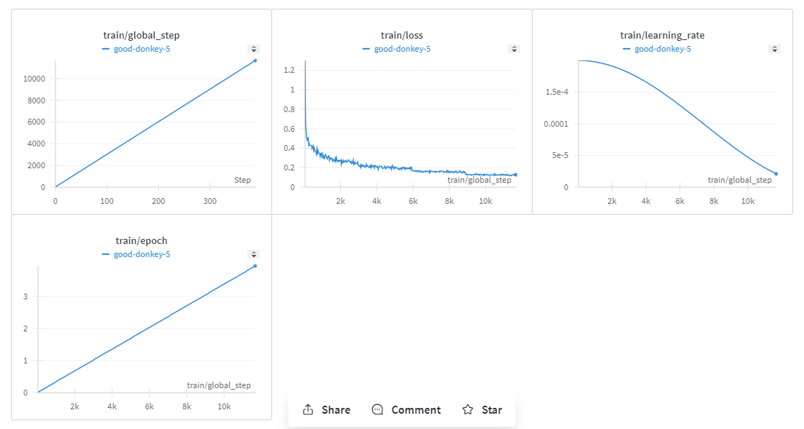

# Medicine Custom LLM
Here we develop Custom LLM train on medicine data using LoRa techniques. I use Phi 1.5 microsoft LLM and it provide very good result. To learn about the custom LLM training and inference go through the given colab.
I explain everything in detail in this colab notebook. What is LoRa PEFT (Parameter Effecinet Tuning).
## Base LLM
  ```code
  microsoft/phi-1_5
  ```
## Dataset
```code
  MattBastar/Medicine_Details
```
Note: This dataset avialable at HuggingFace

## Model Training Logs
<div align="center">
<p>
 </p> 
</div>